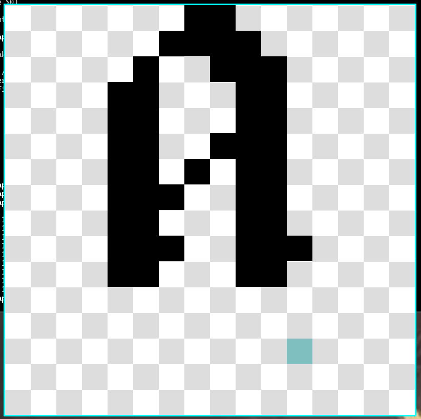

#  Pixel Font Maker

</img>

## About

  cool font maker

##  Build and Run

  Build the project with: ./build.sh
  Run the game with: ./run.sh

## Help

```

   Pxlfnt Maker

   Syntax: ./pxlfnt-maker <character> <pxlfnt file>
   <character>      ASCII character to edit/make
   <pxlfnt file>    path to the font file to edit

   Keybinds:
   mouse L          Draw pixel
   mouse R          Erase pixel
   D                Clear all pixels
   S                Save letter to pxlfnt file
   R                Reload letter from pxlfnt file
   LEFT             Load next letter from pxlfnt file
   RIGHT            Load previous letter from pxlfnt file

```
